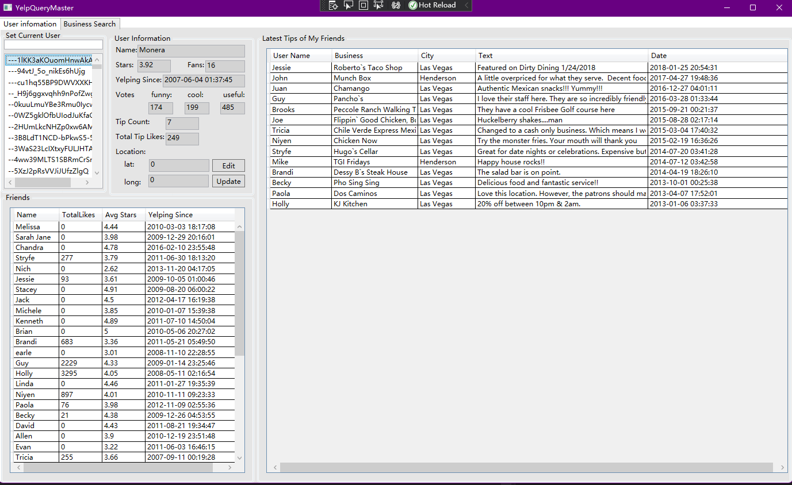
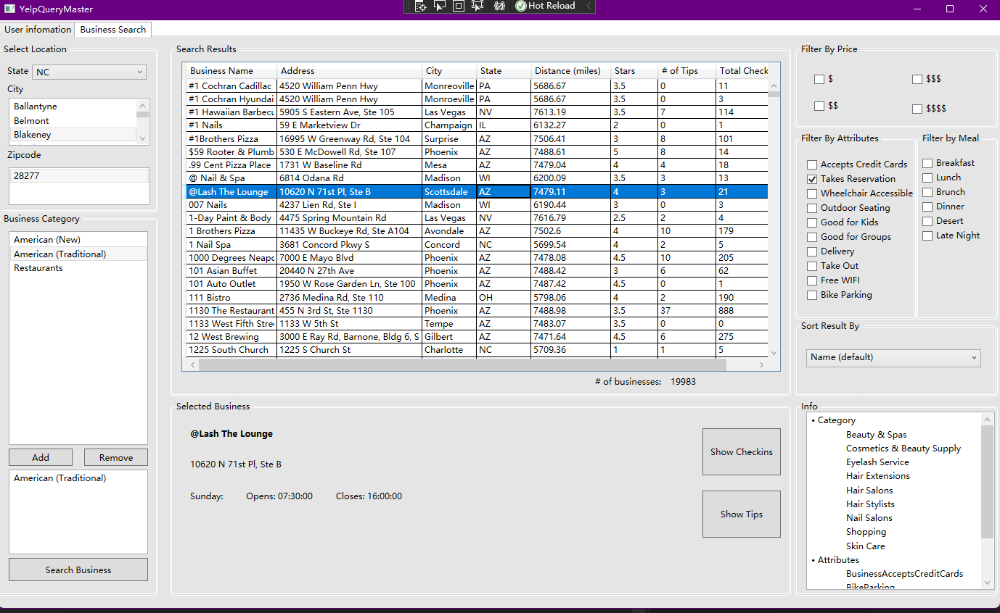

# YelpQueryMaster (Desktop Application)

**Team Members: Xinyu Liu, Boxiang Lin, Xinru Li, Tianhao Huang**

**Catalog**

- [Setup Database Option 1](#Setup-Database-From-Scratch)
- [Setup Database Option 2 (Recommanded)](#Setup-Database-by-Backup-File)
- [Run the C# Application](#Setup-Database-by-Backup-File)
- [Demo](#Demo)


## Setup Database From Scratch

### Step 1
Download the Json file and put them into `data/`, download link = `https://eecs.wsu.edu/~blin1/files.html` click the `YelpQueryMaster yelpJsonData.zip`

Install all of python modules required for parsing and inserting
```bash
pip install -r requirements.txt
```
or for Mac users
```bash
pip3 install -r requirements.txt
```
### Step 2
Modify `.env` file in root directory depending on your database setup.

### Step 3
Import the `./DBSchema/mysql_supremacy_RELATIONS_v2.sql` file into your database to create tables.

### Step 4
To load data into DB, first make sure data files are saved in `./data/`, then running the following commands.
```bash
cd DBPopulate
python mysql_supremacy_parseAndInsert.py
```
or for Mac users

```bash
cd DBPopulate
python3 mysql_supremacy_parseAndInsert.py
```

### Step 5

Load triggers, functions, updates into database, they are located in `SQLScripts/`


## Setup Database by Backup File

### Step 1

Download the backup file at `https://eecs.wsu.edu/~blin1/files.html` click `YelpQueryMaster Backup File`;

### Step 2

Create your database and load the backup file using `\i` 


## Run The Application

1. VS code installed
2. `cd/YelpSrc/`, execute the `YelpSrc.sln`


## Demo

### User Page




### Business Page


